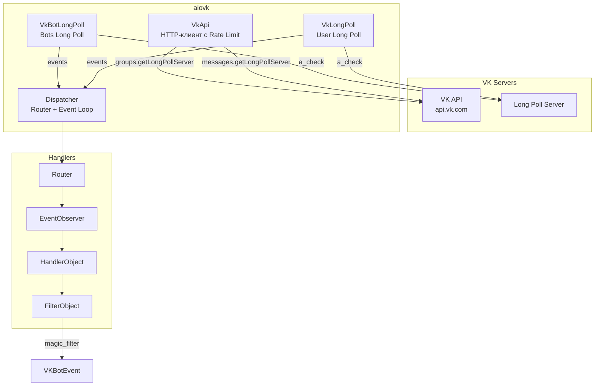
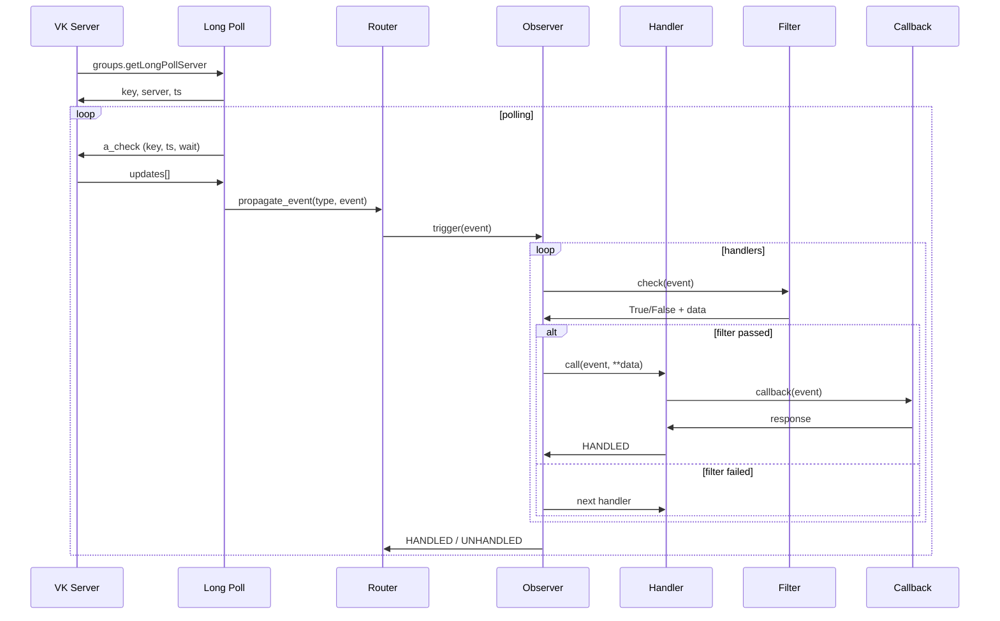
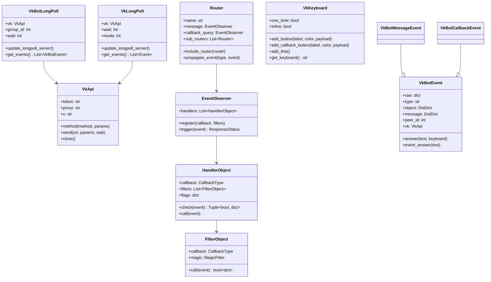
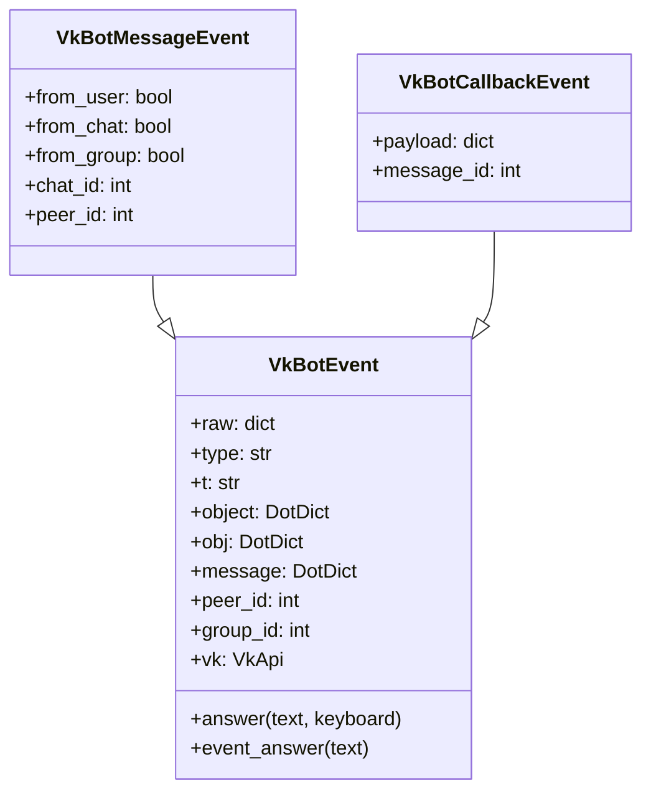
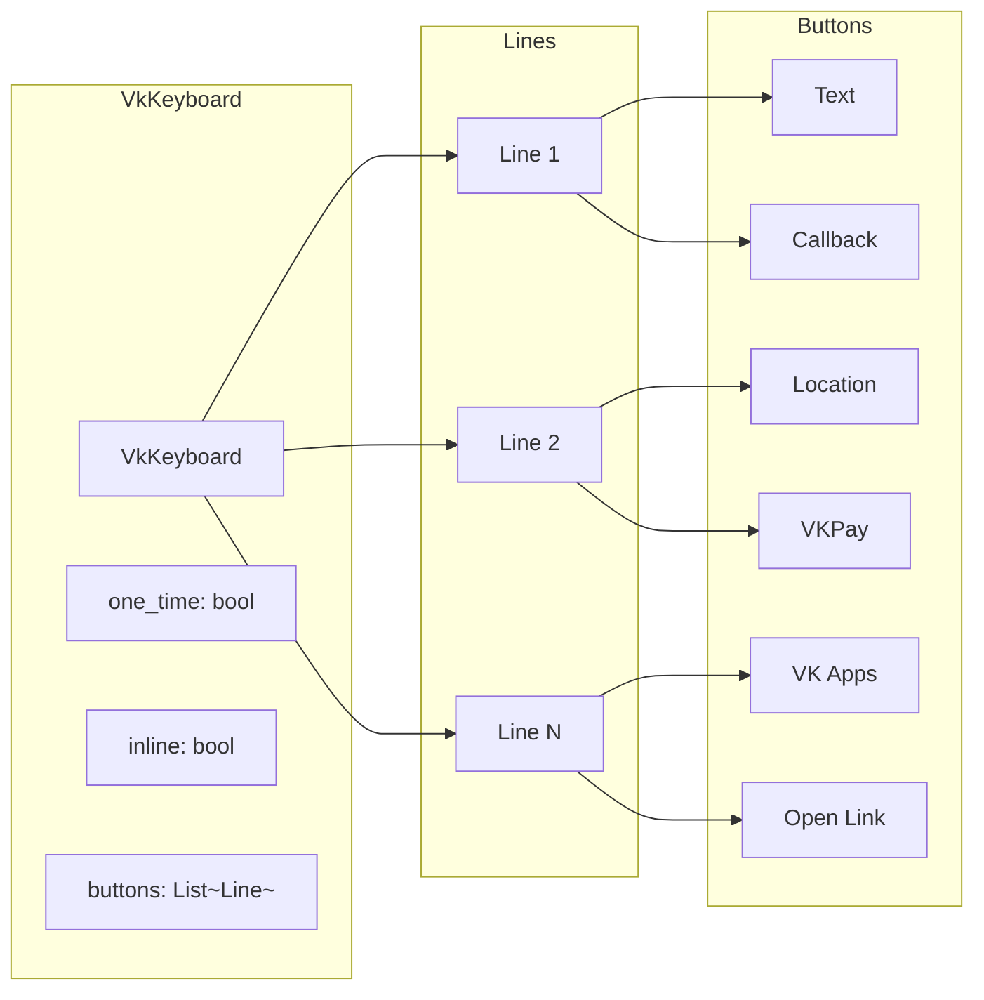
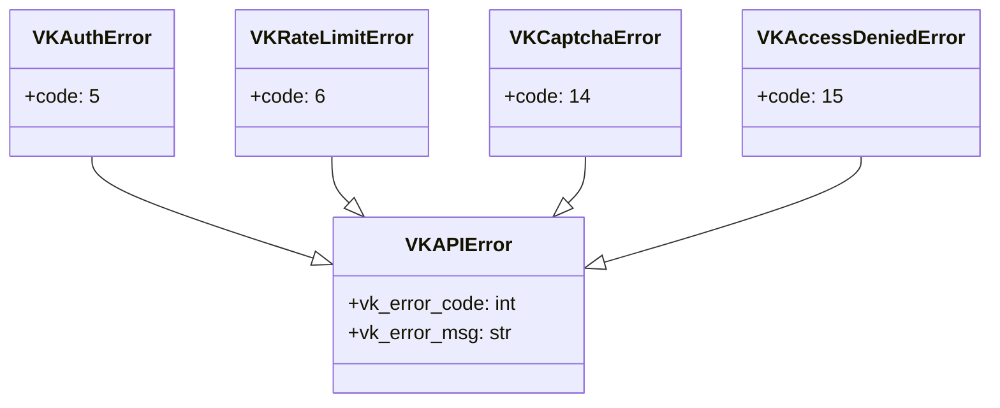
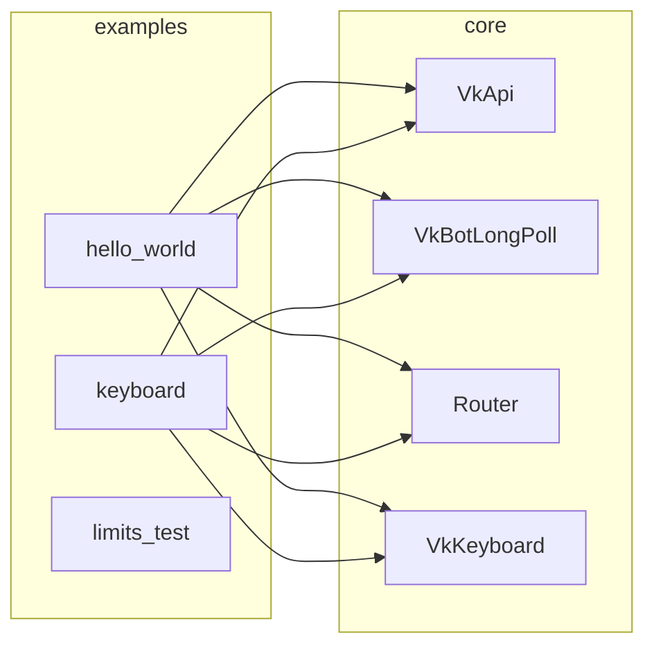

# aiovk

Асинхронная библиотека для работы с VK (VKontakte) API на Python.

Поддерживает **Bots Long Poll API** (группы) и **User Long Poll API** (пользователи), а также клавиатуры, маршрутизацию событий и систему фильтров.

## Возможности

- Асинхронные запросы через `aiohttp`
- Bots Long Poll (`groups.getLongPollServer`)
- User Long Poll (`messages.getLongPollServer`)
- Система маршрутизации событий с фильтрами (на базе `magic_filter`)
- Построитель клавиатур (обычные и inline)
- Поддержка прокси
- Rate limiting

## Архитектура



## Установка

```bash
pip install -r requirements.txt
```

## Быстрый старт (Bots Long Poll)

```python
import asyncio
from core.vk_api import VkApi
from core.bot.bot_longpoll import VkBotLongPoll
from core.handlers.router import Router
from core.bot.bot_events import VkBotMessageEvent

router = Router()


@router.message()
async def echo_handler(event: VkBotMessageEvent):
    await event.answer(f"Вы написали: {event.message.text}")


async def main():
    vk = VkApi(token="your_token")
    server = VkBotLongPoll(vk, group_id=123456)
    await server.update_longpoll_server()

    while True:
        events = await server.get_events()
        for event in events:
            event.vk = vk
            await router.propagate_event(event.type, event)


asyncio.run(main())
```

## Жизненный цикл события



## Структура проекта



## События Bots Long Poll



## Клавиатуры



Цвета кнопок: `VkKeyboardColor.PRIMARY` (синяя), `SECONDARY` (белая), `NEGATIVE` (красная), `POSITIVE` (зелёная).

## Обработка ошибок



## Примеры

Примеры находятся в папке [`examples/`](examples/):

- `hello_world/` — бот с сообщениями и callback-кнопками
- `keyboard/` — пример клавиатур
- `limits_test/` — тест лимитов



## Зависимости

- `aiohttp` — асинхронный HTTP-клиент
- `aiohttp_socks` — поддержка прокси
- `certifi` — SSL-сертификаты
- `python-dotenv` — загрузка `.env`
- `magic-filter` — фильтры для обработчиков
